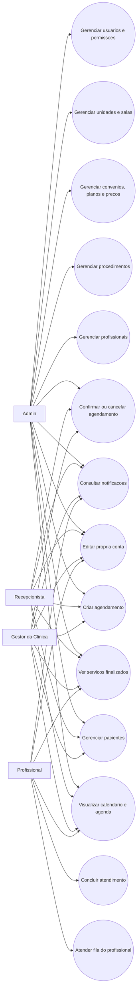
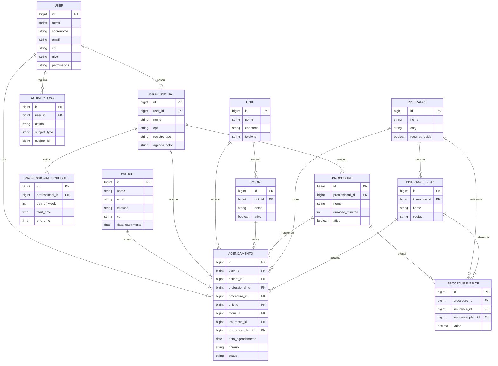
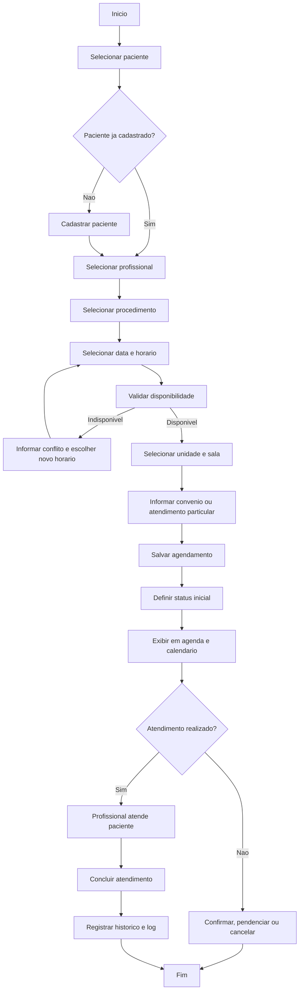

# Requisitos e Diagramas do Sistema

## Requisitos Funcionais

1. O sistema deve autenticar usuários e controlar acesso por perfil.
2. O sistema deve permitir acesso administrativo para os perfis admin, recepcionista, profissional e gestor da clínica, conforme permissões.
3. O sistema deve permitir cadastrar, editar, listar e visualizar pacientes.
4. O sistema deve validar duplicidade de paciente por CPF, e-mail e telefone.
5. O sistema deve permitir cadastrar, editar e listar profissionais de saúde.
6. O sistema deve permitir configurar horários da clínica e horários individuais dos profissionais.
7. O sistema deve permitir cadastrar procedimentos e definir duração de atendimento.
8.  O sistema deve permitir criar agendamentos vinculando paciente, profissional, procedimento .
9.  O sistema deve validar disponibilidade de horário antes de concluir um agendamento.
10. O sistema deve exibir agendamentos em agenda geral e em calendário.
11. O sistema deve permitir confirmar, pendenciar, cancelar e concluir agendamentos.
12. O sistema deve permitir listar confirmações e fila de espera.
13. O sistema deve permitir promover um paciente da fila de espera para um agendamento.
14. O sistema deve permitir que profissionais visualizem sua própria agenda e fila de atendimento.
15. O sistema deve permitir registrar histórico de serviços finalizados.
16. O sistema deve permitir exibir notificações relacionadas a agendamentos.
17. O sistema deve permitir que o usuário edite sua conta, incluindo foto de perfil.
18. O sistema deve registrar logs de atividade para ações relevantes do sistema.
19. O sistema deve permitir gerenciar usuários e permissões de módulos.

## Requisitos Não Funcionais

1. O sistema deve possuir interface web responsiva para desktop e mobile.
2. O sistema deve manter controle de acesso baseado em autenticação e perfil de usuário.
3. O sistema deve preservar integridade dos dados de agendamento e evitar conflitos de horário.
4. O sistema deve registrar trilha de auditoria para ações administrativas importantes.
5. O sistema deve operar com banco de dados relacional MySQL.
6. O sistema deve suportar idioma principal em português do Brasil.
7. O sistema deve apresentar tempo de resposta adequado para consultas de agenda e calendário.
8. O sistema deve permitir manutenção modular de cadastros base, agendamentos, pacientes e profissionais.
9. O sistema deve ser compatível com ambiente local em XAMPP e aplicação Laravel.
10. O sistema deve garantir persistência segura de arquivos enviados, como imagens de perfil.
11. O sistema deve usar layout consistente e navegabilidade clara entre módulos.
12. O sistema deve ser extensível para evolução futura de prontuário, prescrições e laudos.

## Diagrama de Caso de Uso

## Diagrama Modelo Entidade-Relacionamento (MER)

## Diagrama de Atividade

