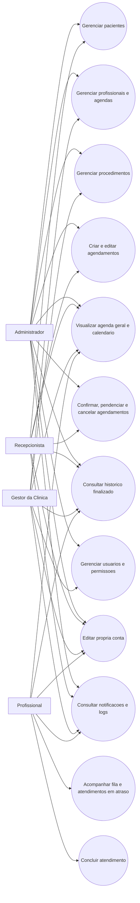
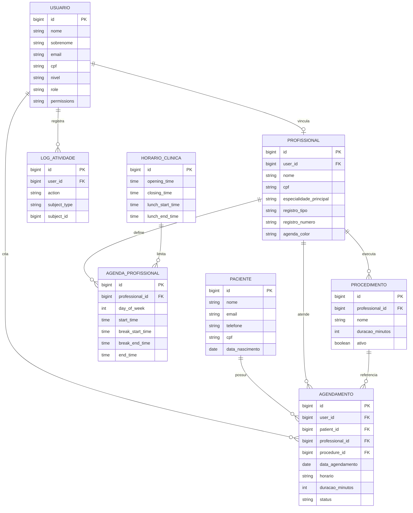
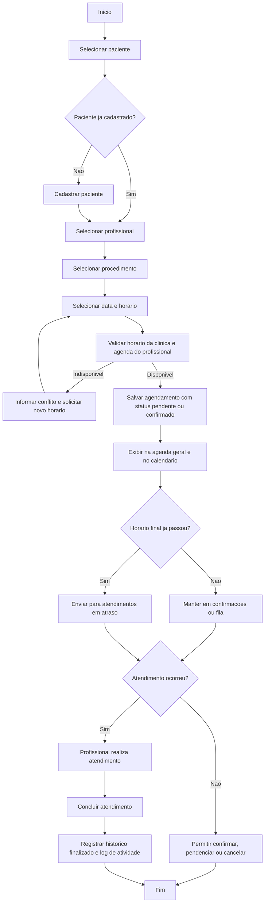

# Requisitos e Diagramas do Sistema

## Requisitos Funcionais

1. O sistema deve autenticar usuários e controlar acesso por perfil e permissões por módulo.
2. O sistema deve permitir acesso administrativo para os perfis admin, recepcionista, profissional e gestor da clínica, respeitando as permissões configuradas.
3. O sistema deve permitir cadastrar, editar, listar, visualizar e inativar pacientes.
4. O sistema deve validar duplicidade de paciente por CPF, e-mail e telefone antes da gravação.
5. O sistema deve permitir cadastrar, editar, listar e excluir profissionais vinculados a usuários com papel profissional.
6. O sistema deve permitir configurar o horário geral da clínica, incluindo intervalo de almoço.
7. O sistema deve permitir configurar vínculos de agenda dos profissionais por dia da semana e impedir horários fora da janela da clínica.
8. O sistema deve permitir cadastrar procedimentos, duração padrão e profissional responsável.
9. O sistema deve permitir cadastrar procedimentos, duração padrão e profissional responsável pelo atendimento.
10. O sistema deve manter o agendamento focado em paciente, profissional, procedimento, data e horário.
11. O sistema deve permitir criar, editar, visualizar, cancelar e concluir agendamentos.
12. O sistema deve validar disponibilidade de profissional, sala, horário da clínica e intervalo de almoço antes de concluir um agendamento.
13. O sistema deve exibir agendamentos na agenda geral e no calendário, com filtros por período e profissional.
14. O sistema deve separar confirmações pendentes dos atendimentos em atraso quando o horário final já tiver sido ultrapassado.
15. O sistema deve permitir que profissionais visualizem apenas sua própria agenda, fila de espera, atendimentos em atraso e histórico finalizado.
16. O sistema deve permitir promover pacientes da fila de espera e alterar o status do agendamento entre pendente, confirmado, cancelado e concluído.
17. O sistema deve registrar logs de atividade para operações relevantes, com identificação do responsável e do usuário afetado.
18. O sistema deve permitir consulta de notificações relacionadas a agendamentos e ações operacionais.
19. O sistema deve permitir edição da própria conta, incluindo foto de perfil.
20. O sistema deve permitir gerenciar usuários e permissões de acesso por submenu.

## Requisitos Não Funcionais

1. O sistema deve possuir interface web responsiva para desktop e dispositivos móveis.
2. O sistema deve manter controle de acesso baseado em autenticação, perfil e permissões por módulo.
3. O sistema deve preservar a integridade dos dados de agendamento, evitando conflitos de horário e profissional.
4. O sistema deve registrar trilha de auditoria para ações administrativas e operacionais críticas.
5. O sistema deve operar com banco de dados relacional MySQL em ambiente Laravel.
6. O sistema deve utilizar português do Brasil como idioma principal da interface.
7. O sistema deve apresentar desempenho adequado em consultas de agenda, calendário, fila e histórico.
8. O sistema deve suportar manutenção modular para pacientes, profissionais, agenda, procedimentos e usuários.
9. O sistema deve ser compatível com execução local em XAMPP e com o fluxo de desenvolvimento do Laravel.
10. O sistema deve garantir persistência segura de arquivos enviados, como imagens de perfil.
11. O sistema deve manter padrão visual consistente e navegação clara entre navbar, sidebar e módulos.
12. O sistema deve ser extensível para evolução futura de prontuário, prescrições, relatórios e laudos.

## Diagrama de Caso de Uso

### Diagrama de Caso de Uso da Navegação do Painel

```mermaid
flowchart TB
    classDef actor fill:#0f4f86,stroke:#0b3b65,stroke-width:1.4px,color:#ffffff;
    classDef usecase fill:#f4ecda,stroke:#8a7a56,stroke-width:1.1px,color:#2b2b2b;
    classDef viewer fill:#eaf4ff,stroke:#5c88b0,stroke-width:1.1px,color:#17324d;
    classDef container fill:#ffffff,stroke:#d6dee8,stroke-width:1px,color:#222222;

    subgraph AdminPanel[Administrador]
        direction LR
        Admin((Administrador)):::actor
        subgraph AdminAcoes[ ]
            direction TB
            AdminUC1([Acessar painel e tutorial]):::usecase
            AdminUC2([Editar propria conta]):::usecase
            AdminUC3([Cadastrar e consultar pacientes]):::usecase
            AdminUC4([Criar e acompanhar agendamentos]):::usecase
            AdminUC5([Confirmar, pendenciar ou cancelar]):::usecase
            AdminUC6([Concluir atendimento e consultar historico]):::usecase
            AdminUC7([Configurar cadastros base]):::usecase
            AdminUC8([Consultar notificacoes]):::usecase
        end
        Admin --- AdminUC1
        Admin --- AdminUC2
        Admin --- AdminUC3
        Admin --- AdminUC4
        Admin --- AdminUC5
        Admin --- AdminUC6
        Admin --- AdminUC7
        Admin --- AdminUC8
    end

    subgraph RecepPanel[Recepcionista]
        direction LR
        Recep((Recepcionista)):::actor
        subgraph RecepAcoes[ ]
            direction TB
            RecepUC1([Acessar painel e tutorial]):::usecase
            RecepUC2([Editar propria conta]):::usecase
            RecepUC3([Cadastrar e consultar pacientes]):::usecase
            RecepUC4([Criar e acompanhar agendamentos]):::usecase
            RecepUC5([Confirmar, pendenciar ou cancelar]):::usecase
            RecepUC6([Consultar historico finalizado]):::usecase
            RecepUC7([Consultar notificacoes]):::usecase
        end
        Recep --- RecepUC1
        Recep --- RecepUC2
        Recep --- RecepUC3
        Recep --- RecepUC4
        Recep --- RecepUC5
        Recep --- RecepUC6
        Recep --- RecepUC7
    end

    subgraph GestorPanel[Gestor da Clinica]
        direction LR
        Gestor((Gestor)):::actor
        subgraph GestorAcoes[ ]
            direction TB
            GestorUC1([Acessar painel e tutorial]):::viewer
            GestorUC2([Editar propria conta]):::usecase
            GestorUC3([Visualizar pacientes]):::viewer
            GestorUC4([Visualizar agendamentos e historico]):::viewer
            GestorUC5([Visualizar painel do profissional]):::viewer
            GestorUC6([Gerenciar cadastros base]):::usecase
            GestorUC7([Gerenciar usuarios de menor privilegio]):::usecase
            GestorUC8([Consultar notificacoes]):::viewer
        end
        Gestor --- GestorUC1
        Gestor --- GestorUC2
        Gestor --- GestorUC3
        Gestor --- GestorUC4
        Gestor --- GestorUC5
        Gestor --- GestorUC6
        Gestor --- GestorUC7
        Gestor --- GestorUC8
    end

    subgraph ProfPanel[Profissional]
        direction LR
        Prof((Profissional)):::actor
        subgraph ProfAcoes[ ]
            direction TB
            ProfUC1([Acessar painel e tutorial]):::usecase
            ProfUC2([Editar propria conta]):::usecase
            ProfUC3([Acompanhar agendamentos]):::usecase
            ProfUC4([Confirmar, pendenciar e cancelar]):::usecase
            ProfUC5([Acompanhar fila e atrasos]):::usecase
            ProfUC6([Concluir atendimento]):::usecase
            ProfUC7([Consultar historico finalizado]):::usecase
            ProfUC8([Consultar notificacoes]):::usecase
        end
        Prof --- ProfUC1
        Prof --- ProfUC2
        Prof --- ProfUC3
        Prof --- ProfUC4
        Prof --- ProfUC5
        Prof --- ProfUC6
        Prof --- ProfUC7
        Prof --- ProfUC8
    end

    class AdminPanel,RecepPanel,GestorPanel,ProfPanel container;
```

## Diagrama Modelo Entidade-Relacionamento (MER)

## Diagrama de Atividade

